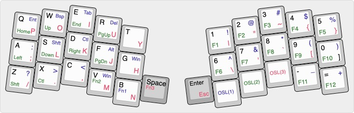

My qmk firmware files for the [rainkeebs](https://www.rainkeebs.mx) [manta](https://www.rainkeebs.mx/product/manta-keyboard-kit). Wrote these so I could use [via](https://caniusevia.com).

* includes info.json
* includes via subfolder. manta.json is to be loaded from via manually
* I used an Elite-C, so the bootloader is atmel-dfu

